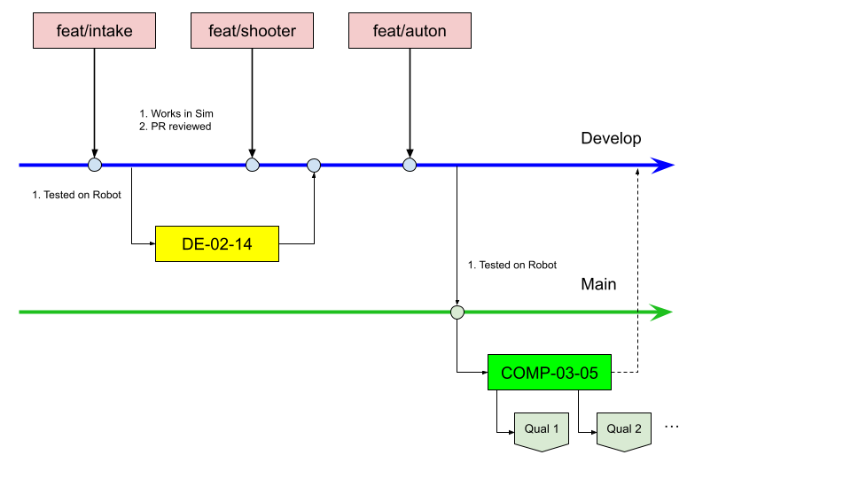

# Team 8736 The Mechanisms - 2026 Robot

## 🤝 Contributing to this Repository

**Key Points:**
* **DO NOT** push directly to the `main` branch.
* Create a new branch for your feature or bugfix (e.g., `feature/new-logging-util` or `fix/swerve-bug`) using `develop` as your source branch
* Submit a **Pull Request (PR)** and request a review from a mentor and other programmers AFTER a succesful simulation to merge your code back into `develop`



### How to Read This Diagram
This map shows how our code travels from your brain to the robot's "brain" on the field. Think of the Main and Develop lines as a permanent history of our team's progress.

The Lab (Top): Individual student work happens in the pink boxes. This is where we break things and learn. Code here is "untrusted" until it is reviewed and merged into Develop.

The Integration (Middle): The blue line is our "Team Truth." It’s what we use for shop nights and practice sessions (yellow boxes). Before any competition, we "freeze" the best version of this code and move it down to Main.

The Field (Bottom): The green line is sacred. At an event, we create a specific COMP branch. Any changes made in the pits are committed here and immediately Tagged (the blue boxes).

Why the Tags? These are "Save Points." If the robot stops working during Qual 2, we can instantly look back at the Qual 1 tag to see exactly what changed. This ensures we never lose a working version of the robot in the heat of competition.

Pit Commands:

- New Fix: ```git checkout -b fix/logic-error```

- Apply Fix: ```git checkout COMP-03-05 -> git merge fix/logic-error```

- Tag Match: ```git tag -a Qual-1 -m "Short description"```

---

## TODO: [Students] Update this README file for our competition bot

<!--
### A reusable, modular, and extendable code framework for FRC robots.

This repository contains the foundational code architecture for Team 8736. It is designed to be the **starting point** for each new competition season, allowing us to build reliable, maintainable, and sophisticated robot code faster.

**Note:** This repository is a **foundational framework**. Do not commit game-specific code directly here. Use this to start your new season's project.

## 🏛️ Core Philosophy
The goal of this architecture is to solve common problems once, so we can focus on new challenges each year. Our core principles are:

* **Modularity:** Each robot mechanism (e.g., Drivetrain, Intake, Arm) is an isolated `Subsystem`.
* **Reusability:** Code for common components (e.g., PID controllers, logging, motor wrappers) is built here and reused.
* **Testability:** The architecture is structured to support unit Testing and simulation to verify logic without a physical robot.
* **Clarity:** We enforce a strict code structure and style guide to make code easy to read and understand for new members.

## ✨ Key Features
This framework provides several key features out-of-the-box:

* **Advanced Logging:** A built-in logging utility that [e.g., writes to NetworkTables and integrates with AdvantageScope].
* **Constants Management:** A centralized `Constants.java` structure that separates tuning values from logic, with different sets of constants for the competition robot vs. the offseason robot.
* **Modules:** Common helper functions for pose estimators and PID controllers.

## 🚀 Getting Started: Using this for a New Season

Follow these steps to start your new season's codebase from this architecture.

1.  **Create a new, blank repository** on GitHub for your new season.
    * Name it `8736-FRC-[Year]-[GameName]` (e.g., `8736-FRC-2024-Crescendo`).

2.  **Clone this architecture repository** to your local machine.
    ```bash
    git clone https://github.com/Mechanisms-Robotics/modular-robot-reference-architecture.git
    ```
    *This will create a folder named `[architecture-repo-name]`.*

3.  **Navigate into the cloned directory.**
    ```bash
    cd [architecture-repo-name]
    ```

4.  **Rename the remote** from `origin` (which points to this repo) to `template`.
    ```bash
    git remote rename origin template
    ```

5.  **Link your new season's repository** as the new `origin`.
    ```bash
    git remote add origin [URL-of-your-new-empty-repo.git]
    ```

6.  **Push the code** to your new season's repository.
    ```bash
    git push -u origin main
    ```
    *(You may need to use `-f` or `--force` for the first push if your new repo is not completely empty)*.

7.  **Build the Project:**
    * Open the cloned folder in WPILib VS Code.
    * Run the `WPILib: Build Robot Code` command from the command palette (Ctrl+Shift+P).
    * Ensure it builds successfully before making any changes.

## 💻 Team 8736 Coding Standards
All code contributed to this repository (and to season repositories) **must** follow the team's official coding standards. This is critical for maintainability and onboarding new members.

**[➡️ Find the official Team 8736 Coding Standards here](https://docs.google.com/document/d/1i7vQb6MojpwAiYMbqEBVxQlvooK5sS3bgigXcNyty4E/edit?tab=t.0#heading=h.8b2xyd82witc)**

## 🔧 How to Add a New Mechanism (e.g., an Intake)

Here is the standard workflow for adding a new part to the robot using this architecture:

### 1. Create the Subsystem
* Create a new file: `src/main/java/frc/robot/subsystems/IntakeSubsystem.java`
* Add your hardware components (motors, sensors) as private variables.
* Write public methods for all actions (e.g., `runIntake()`, `stopIntake()`).
* Implement any required methods from the base class (like `periodic()` or `logData()`).


### 2. Add Constants
* TODO: fill this in


### 3. Create Commands
* Create new files in `src/main/java/frc/robot/commands/` for intake actions (e.g., `RunIntake.java`, `StopIntake.java`).
* In your command, `require` the `IntakeSubsystem` in the constructor.
* Call the subsystem's public methods in the `execute()` and `end()` methods.

### 4. Register the Subsystem
* In `src/main/a/frc/robot/RobotContainer.java`, create a new **private final** instance of your `IntakeSubsystem`.
    ```java
    private final IntakeSubsystem m_intake = new IntakeSubsystem();
    ```

### 5. Bind Controls
* In the `RobotContainer` constructor, use the `configureButtonBindings()` method to link a controller button to your new commands.
    ```java
    private void configureButtonBindings() {
        // ...other bindings...
        m_operatorController.a().onTrue(new RunIntake(m_intake, IntakeConstants.kDefaultIntakeSpeed));
        m_operatorController.a().onFalse(new StopIntake(m_intake));
    }
    ``` -->

